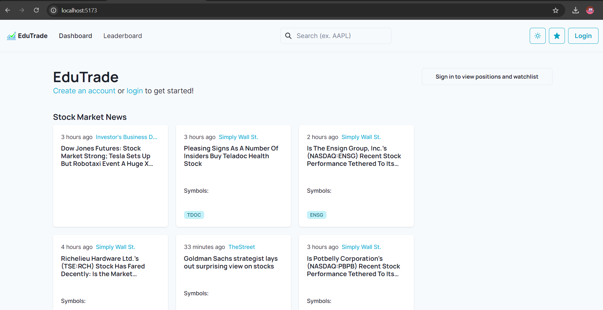
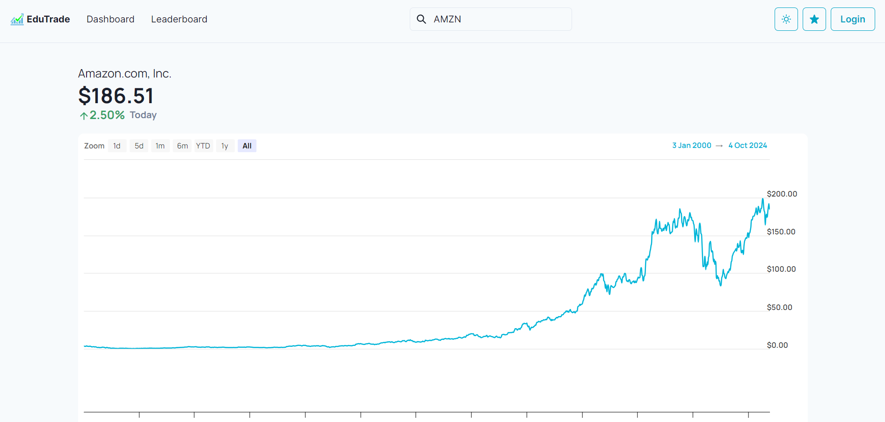
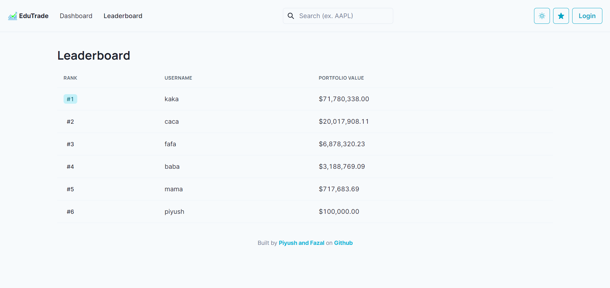
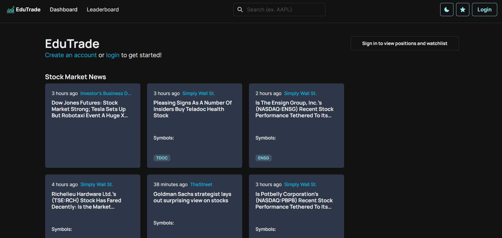
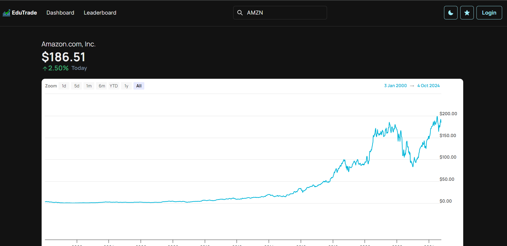
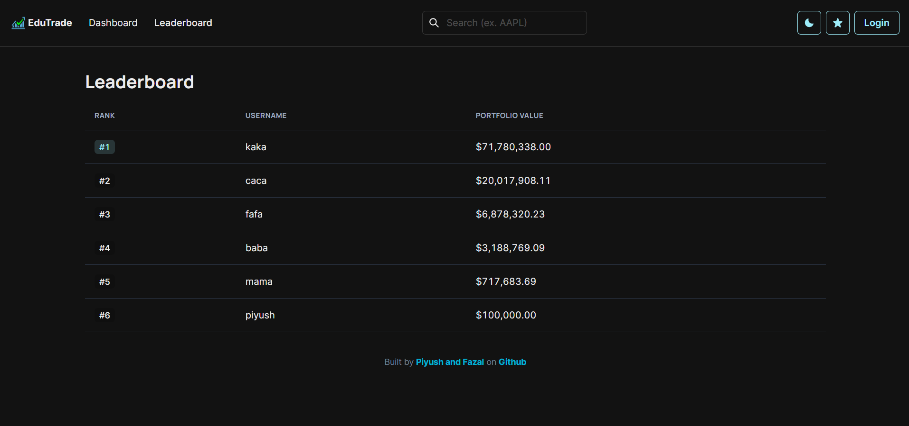

# 🚀 EduTrade: Your Fake Money Trading Platform 🤑

EduTrade is a cutting-edge simulated stock trading platform where users can trade with fake money. The platform is designed with security, performance, and realism in mind. Featuring JWT-based authentication, users can log in, sign up, and build their virtual stock portfolio using real-time stock data. Whether you're new to trading or an enthusiast, EduTrade gives you a risk-free way to explore stock markets and hone your trading skills!

---

## 🌟 Features

- ### 📰 Stock-Related News Updates: Whenever a user selects a stock and refreshes the page, **the latest news articles related to that specific stock will seamlessly appear right after the chart.** This feature keeps users informed with up-to-date information tailored to their interests!

- 📈 Simulated Trading: Trade stocks with fake money using real-time data.
- 🔐 JWT Authentication: Secure sign-up and login with JWT tokens.
- 💹 Real Stock Data: Fetch live stock data and news from multiple sources (Yahoo Finance, NewsFilter).
- 📊 Portfolio Management: Track your holdings and view detailed portfolio value updates.
- 💵 Buy & Sell Stocks: Seamlessly execute stock transactions in your virtual account.
- 🏆 Leaderboards: Compete with other users and climb the leaderboard based on portfolio performance.
- 📰 Financial News: Get the latest financial news relevant to your portfolio.

---

## 🛠️ Getting Started

Follow these instructions to get a copy of the project up and running locally.

### Prerequisites

Ensure you have the following installed on your local machine:

- **Node.js** (v14+)
- **npm** or **yarn**
- **MongoDB** (locally through MongoDB Compass)

### Installation

1. **Clone the repository**:
   ```bash
   git clone https://github.com/PiyushMSoni/EduTrade.git
   cd EduTrade
   ```

2. **Install dependencies for the backend**:
   ```bash
   cd backend
   npm install
   ```

3. **Set up environment variables for the backend**:
   Create a `.env` file in the `backend` directory and configure the following variables:
   ```bash
   EduTrade_JWT_SECRET=your-jwt-secret
   EduTrade_NEWSFILTER_API=your-newsfilter-api-key
   EduTrade_ALPHAVANTAGE_API=your-alphavantage-api-key
   ```

4. **Start the backend server**:
   ```bash
   npm run dev
   ```

5. **Install dependencies for the frontend**:
   ```bash
   cd ../frontend
   npm install
   ```

6. **Start the frontend server**:
   ```bash
   npm run dev
   ```

The backend server will start on port **3010** by default, and the frontend will run on port **3000**. You can access the app at [http://localhost:3000](http://localhost:3000).

---

## 🛠️ API Endpoints

EduTrade exposes a variety of API endpoints for interacting with users, stocks, and leaderboards. Below are some key endpoints:

### User Routes
- POST /api/users/signup: Sign up a new user
- POST /api/users/login: Log in a user

### Stock Routes
- GET /api/stocks/:symbol: Fetch real-time stock data
- POST /api/stocks/buy: Buy stocks
- POST /api/stocks/sell: Sell stocks

### Leaderboard
- GET /api/leaderboard: Get the top-performing users based on portfolio value

---
## 🖼️ Screenshots

Add your app screenshots here once you're ready!

- **Dashboard**
- **Stock Page**
- **Leaderboard**
- **Dark Mode - Dashboard**
- **Dark Mode - Stock Page**
- **Dark Mode - Leaderboard**

---

## 🛡️ Security

- **Authentication**: JWT (JSON Web Tokens) are used for secure user authentication.
- **Sensitive Data**: Make sure to never expose sensitive information like API keys or JWT secrets in the frontend.

---

## 👨‍💻 Contributing

We welcome contributions! If you'd like to improve EduTrade, please follow these steps:

1. Fork the repository
2. Create a new branch (`git checkout -b feature/your-feature`)
3. Commit your changes (`git commit -m 'Add some feature'`)
4. Push to the branch (`git push origin feature/your-feature`)
5. Open a Pull Request

---

## 📄 License

This project is licensed under the MIT License - see the LICENSE file for details.

---

## 🗂️ Project Structure

```bash
📦 EduTrade
├── 📁 backend
│   ├── 📁 src
│   │   ├── 📁 controller        # Handles all API routes and business logic
│   │   │   ├── auth.controller.ts
│   │   │   ├── leaderboard.controller.ts
│   │   │   ├── news.controller.ts
│   │   │   ├── stocks.controller.ts
│   │   │   └── user.controller.ts
│   │   ├── 📁 middleware        # Custom middleware for the app
│   │   ├── 📁 models            # Database models using Mongoose
│   │   ├── 📁 utils             # Utility functions for caching, data manipulation, etc.
│   │   ├── 📁 routes            # API routes for express
│   │   ├── 📄 index.ts          # Entry point for the backend server
│   │   └── 📄 routes.ts         # Route configuration
│   ├── 📄 package.json          # Node.js dependencies and scripts
│   └── 📄 swagger-output.json   # Swagger documentation for the API
├── 📁 frontend
│   ├── 📁 src
│   │   ├── 📁 components        # Reusable React components
│   │   │   ├── AccountMenu.tsx
│   │   │   ├── Ledger.tsx
│   │   │   ├── Navbar.tsx
│   │   │   ├── Newfeed.tsx
│   │   │   ├── PortfolioPreview.tsx
│   │   │   ├── PositionList.tsx
│   │   │   ├── SearchBox.tsx
│   │   │   ├── StockCard.tsx
│   │   │   ├── StockChart.tsx
│   │   │   ├── TransactionPane.tsx
│   │   │   └── Watchlist.tsx
│   │   ├── 📁 pages             # Main pages of the application
│   │   │   ├── Dashboard.tsx
│   │   │   ├── Leaderboard.tsx
│   │   │   ├── Login.tsx
│   │   │   ├── Signup.tsx
│   │   │   ├── StockView.tsx
│   │   │   └── NotFound.tsx
│   │   ├── 📁 services          # Services for API calls
│   │   │   ├── accounts.service.tsx
│   │   │   ├── api.service.tsx
│   │   │   └── tokens.service.tsx
│   │   ├── 📄 App.tsx           # Main app entry file
│   │   └── 📄 main.tsx          # React entry point
│   ├── 📁 public                # Public assets like logo
│   ├── 📄 package.json          # Node.js dependencies and scripts for the frontend
│   ├── 📄 index.html            # Frontend root HTML
└── 📄 README.md                 # Project documentation
